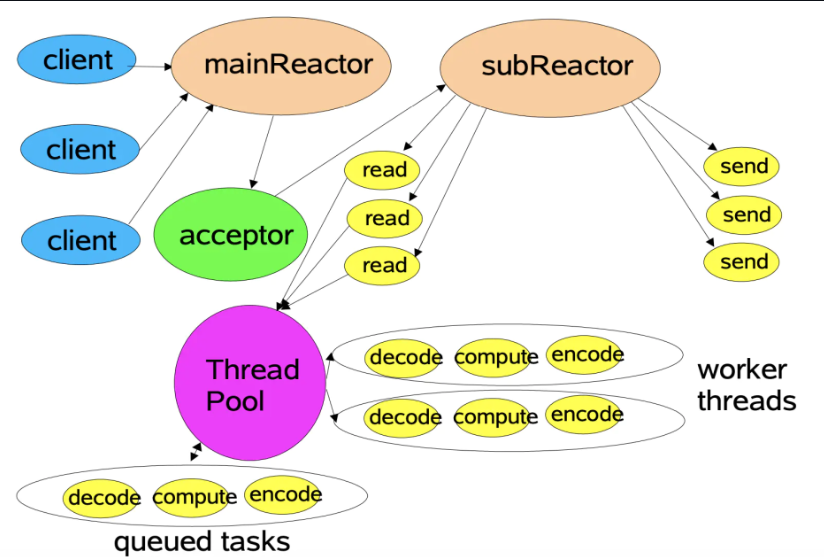

# **项目名称：通过c++11新特性重构 Muduo 网络库的核心代码**

#### **项目简介**

**Muduo 是一个高性能的 C++ 网络库，其核心是基于 Reactor 模式的事件驱动编程模型**

* **运行模式**：采用一个主线程（main loop）和多个子线程（sub loop）实现多线程的 I/O 复用。
* 主线程负责监听新连接，子线程处理具体的 I/O 事件。
* 主线程通过创建 Acceptor 对象监听连接，并将连接分发给子线程。
* 子线程运行 EventLoop 管理事件。
* 使用现代 C++（C++11）重写 Muduo 的核心代码，提高可维护性和扩展性。

---

### **并发模型**


---

### **项目亮点**

#### 1、高并发非阻塞网络库
muduo采用Reactor多模型多线程的结合，实现了高并发非阻塞的网络库。

#### 2、智能指针防止悬空指针
TcpConnection继承自enable_shared_from_this，其目的是防止在不该被释放对象的地方释放对象，导致悬空指针的产生。
这样可以避免用户可能在处理OnMessage事件时删除对象，确保TcpConnection以正确方式释放。

#### 3、唤醒机制
EventLoop中使用了eventfd来调用wakeup()，让mainloop唤醒subloop的epoll_wait阻塞。
 
#### 4、一致性哈希轮询算法
新增ConsistenHash头文件，采用一致性哈希轮询算法，将EventLoop合理分发给每一个TcpConnection对象。
此外，支持自定义哈希函数，满足高并发需求。但需要注意虚拟节点数量不能过少。

#### 5、线程创建有序性
在Thread中通过C++ lambda表达式以及信号量机制，保证线程创建的有序性，确保线程正常创建后再执行线程函数。

#### 6、非阻塞核心缓冲区
Buffer.*是muduo网络库非阻塞的核心模块。当触发相应的读写事件时，内核缓冲区可能没有足够空间一次性发送数据，此时有两种选择：

第一种是将其设置为非阻塞，但可能造成 CPU 忙等待；
第二种是阻塞等待内核缓冲区有空间再发送，但效率低下。
为了解决这些问题，Buffer模块将多余数据存储在用户缓冲区，并注册相应的读写事件监听，待事件再次触发时统一发送。

#### 7、灵活的日志模块
Logger支持设置日志等级。在调试代码时，可以开启DEBUG模式打印日志；而在服务器运行时，为了减少日志对性能的影响，可关闭DEBUG相关日志输出。

---

#### **开发环境**
* linux kernel version5.15.0-113-generic (ubuntu 22.04.6)
* gcc (Ubuntu 11.4.0-1ubuntu1~22.04) 14.4.0
* cmake version 3.22

---

#### **技术实现**

##### **Reactor 模型**

* 基于事件驱动设计，使用 `Poller` 和 `Channel` 实现事件分发与管理。
* 主线程管理新连接，分发给子线程的 `EventLoop` 处理具体的事件。
* 支持多种事件类型：读写事件、异常事件等。

##### **线程池设计**

* 使用 `EventLoopThreadPool` 管理子线程池。
* 主线程将任务分发到线程池中的空闲线程，避免频繁创建销毁线程的开销。
* 子线程独立运行事件循环，确保线程间互不干扰。

##### **连接管理**

* 使用 `TcpConnection` 类封装连接管理，包括状态维护、回调处理。
* 提供连接的生命周期管理，支持连接的创建、使用和销毁。
* 使用 `Buffer` 进行高效的数据读写缓冲。

##### **日志系统**

* 提供简单高效的日志记录功能，通过 `Logger` 类实现。
* 支持多级日志输出：INFO、WARN、ERROR，便于调试与定位问题。
* 单例模式设计，确保全局统一的日志管理。

---

#### **项目结构**


---

#### **运行方法**

1. **克隆代码**

```bash
git clone https://github.com/monster176/MyMuduo.git
cd myMuduo
```

2. **安装项目**

```bash
sudo ./autobuild.sh
```

4. **运行测试代码**

```bash
cd test/
make
./testserver
```

---

#### **收获与反思**

**深入理解网络编程**

* 理解了多线程与 I/O 多路复用的结合使用。
* 掌握了 Reactor 模型的设计思想和实现细节。

**提高代码质量**

* 通过 C++11 的特性（如智能指针、atomic 等），重构 Muduo 的代码，提高代码的安全性与可读性。

**掌握模块化设计**

* 学会如何对复杂系统进行模块划分，增强了项目的扩展性与维护性。

**对未来的启发**

* 学习优秀的开源项目设计理念，如日志系统、线程池等。
* 为后续开发更复杂的网络服务框架积累了经验。
