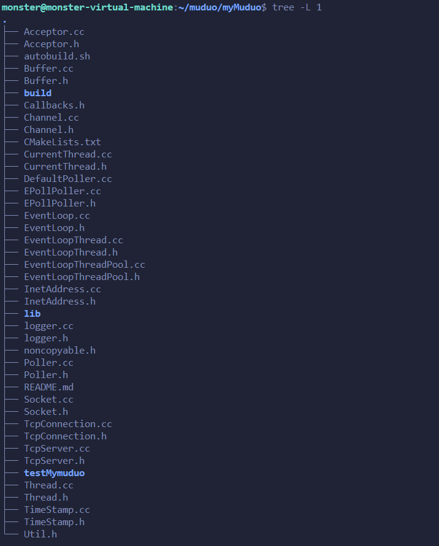

# MyMuduo

项目简介
Muduo 是一个高性能的 C++ 网络库，其核心是基于 Reactor 模式的事件驱动编程模型

运行模式：采用一个主线程（main loop）和多个子线程（sub loop）实现多线程的 I/O 复用。
主线程负责监听新连接，子线程处理具体的 I/O 事件。
主线程通过创建 Acceptor 对象监听连接，并将连接分发给子线程。
子线程运行 EventLoop 管理事件。
使用现代 C++（C++11）重写 Muduo 的核心代码，提高可维护性和扩展性。
项目亮点
基于 Reactor 模型的高效事件驱动：实现了高性能的 I/O 多路复用，充分利用系统资源。
线程池优化：通过线程池减少线程创建和销毁的开销，提升系统的并发能力。
轻量级封装：封装 Socket、Poller 等系统调用，提供高效易用的 API。
高可扩展性：模块化设计，便于功能扩展和维护。
现代 C++ 风格：代码符合现代 C++ 编程规范，提升代码质量与可读性。
技术实现
Reactor 模型
基于事件驱动设计，使用 Poller 和 Channel 实现事件分发与管理。
主线程管理新连接，分发给子线程的 EventLoop 处理具体的事件。
支持多种事件类型：读写事件、异常事件等。
线程池设计
使用 EventLoopThreadPool 管理子线程池。
主线程将任务分发到线程池中的空闲线程，避免频繁创建销毁线程的开销。
子线程独立运行事件循环，确保线程间互不干扰。
连接管理
使用 TcpConnection 类封装连接管理，包括状态维护、回调处理。
提供连接的生命周期管理，支持连接的创建、使用和销毁。
使用 Buffer 进行高效的数据读写缓冲。
日志系统
提供简单高效的日志记录功能，通过 Logger 类实现。
支持多级日志输出：INFO、WARN、ERROR，便于调试与定位问题。
单例模式设计，确保全局统一的日志管理。
项目结构
